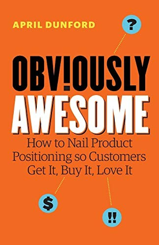
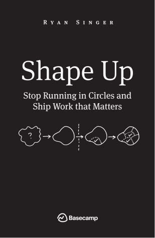
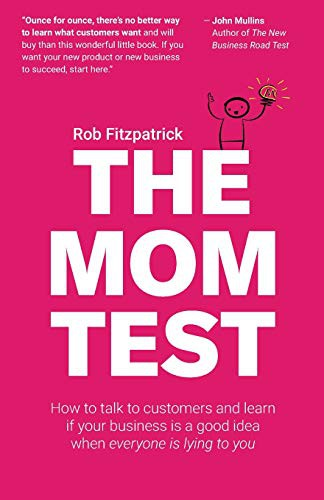
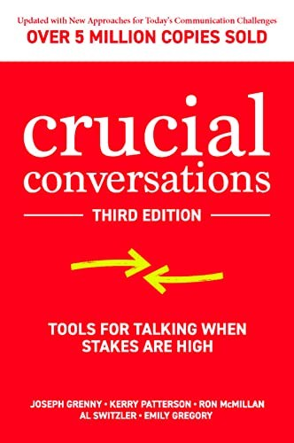
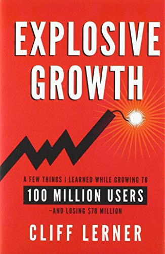
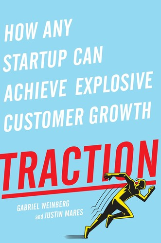
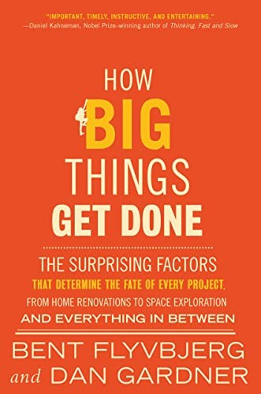
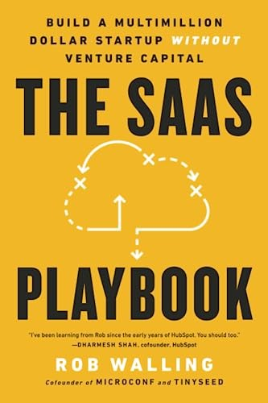
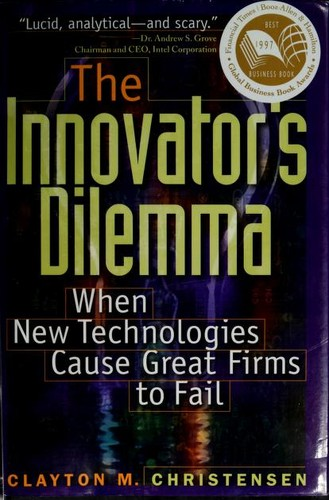
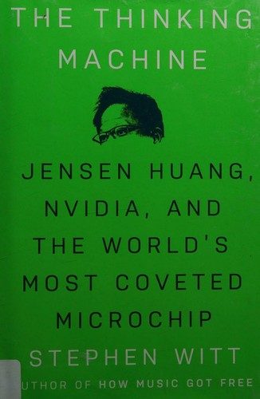

# Armanc Keser

```js
const state = 'Learning'
```

`product` `python` `self-hosting` `agents`

## Favourites

<!-- A table, not a paragraph: GitHub's production CSS sets `img { display: block }`
     inside the README body, so inline images stack vertically instead of forming a row. -->
<table>
<tr>
<td></td>
<td></td>
<td></td>
<td></td>
</tr>
</table>

## Recently read

<table>
<tr>
<td></td>
<td></td>
<td></td>
<td></td>
<td></td>
<td></td>
</tr>
</table>

| Rated | Read | Book | Notes |
|:--|:--|:--|:--|
| `─────` | Jul&nbsp;2026 | **Explosive Growth** · Cliff Lerner | Stories about companies told from the inside are interesting to me. How much did I learn? Not sure, but a fun read regardless. |
| `─────` | Jul&nbsp;2026 | **Get Scalable** · Ryan Deiss | Some valuable things here, like the formalization of value engines. Worth more to an actual startup owner than to me. |
| `─────` | Jul&nbsp;2026 | **Traction** · Weinberg, Mares | A 3.5 that I won't rate: the points it loses are for being less relevant today, not for the quality of the book. Could use an update. |
| `●●●○○` | Jun&nbsp;2026 | **How Big Things Get Done** · Flyvbjerg, Gardner | Liked it, but it's one or two simple ideas repeated. I wanted more on how to plan well and less on how planning fails. |
| `●●●●○` | Jun&nbsp;2026 | **The SaaS Playbook** · Rob Walling | Short, dense, and far more timeless than the others in this stretch. |
| `●●●●○` | May&nbsp;2026 | **The Innovator's Dilemma** · Clayton Christensen | Very insightful, especially right now, with the world adjusting to the most disruptive technology to ever exist. |
| `●●●○○` | May&nbsp;2026 | **The Thinking Machine** · Stephen Witt | A 2.5. The history, and the objective record of which decisions were made and why, was the interesting part. |

## Lists

**Product thinking, in order.** If you read four, read these four, in this order.

- [The Mom Test](https://www.momtestbook.com/) · how to ask questions that don't produce flattering lies
- [Obviously Awesome](https://www.aprildunford.com/obviously-awesome) · positioning, in an afternoon
- [Inspired](https://www.svpg.com/books/inspired-how-to-create-tech-products-customers-love-2nd-edition/) · why a few products work and most don't
- [Shape Up](https://basecamp.com/shapeup) · how to scope work so it actually ships, free to read online

**People who explain things visually.** Nobody does this better.

- [Bartosz Ciechanowski](https://ciechanow.ski/) · interactive essays on how physical things work
- [samwho.dev](https://samwho.dev/) · load balancing, memory allocators, all of it playable
- [Sebastian Lague](https://www.youtube.com/@SebastianLague) · algorithms and game concepts, beautifully
- [Acerola](https://www.youtube.com/@Acerola_t) · graphics programming
- [Pezzza's Work](https://www.youtube.com/@PezzzasWork) · physics simulations, raytracing, ML from scratch

**Learn CSS properly.** Fundamentals first, then layout intuition.

- [Kevin Powell](https://www.youtube.com/@KevinPowell) · start here
- [Josh Comeau](https://www.joshwcomeau.com/) · the interactive version
- [Ahmad Shadeed](https://ishadeed.com/) · layout patterns, deeply
- [Jake Archibald](https://jakearchibald.com/) · what the browser is actually doing
- [Juxtopposed](https://www.youtube.com/@juxtopposed) · redesigning bad interfaces

**Python, properly.** Past syntax, into judgment.

- [python-patterns.guide](https://python-patterns.guide/) · patterns, explained clearly
- [Hynek Schlawack](https://www.youtube.com/@The_Hynek) · domain-driven design and nuance
- [Trey Hunner](https://treyhunner.com/) · fundamentals
- [mCoding](https://www.youtube.com/@mCoding) · internals
- [anthonywritescode](https://www.youtube.com/@anthonywritescode) · open source in practice

**Bootstrapped SaaS.** Building without venture capital.

- [The SaaS Playbook](https://saasplaybook.com/) · the short, dense one
- [MicroConf](https://www.youtube.com/@MicroConf) · talks from the people who wrote it
- [Rework](https://basecamp.com/books/rework) · the argument for staying small

## The shelf

Everything I've finished, with what it was good for. Low ratings are here on purpose.

`●●●●○` out of five &nbsp;&nbsp; `─────` read, deliberately not rated

<details>
<summary><b>Writing better software</b></summary>

| Rated | Book | Author | Notes |
|:--|:--|:--|:--|
| `●●●●○` | The Pragmatic Programmer | Hunt, Thomas | Foundation for being a good engineer |
| `●●●●○` | Architecture Patterns with Python | Percival, Gregory | Non-prescriptive, anticipates your questions, sums up tradeoffs well. Gripe: the central example is a warehouse. |

- [python-patterns.guide](https://python-patterns.guide/) · Python design patterns, clearly explained
- [zakirullin/cognitive-load](https://github.com/zakirullin/cognitive-load) · writing code for human brains
- [Martin Fowler](https://martinfowler.com/) · design patterns and refactoring
- [Simon Willison](https://simonwillison.net/) · engineering notes on everything
- [Julia Evans](https://jvns.ca/) · tools, terminals, how things actually work
- [Database Fundamentals](https://tontinton.com/posts/database-fundementals/) · storage engines, ACID, distributed systems from first principles
- [AI Blindspots](https://ezyang.github.io/ai-blindspots/) · where LLMs reliably fail
- [devhints.io](https://devhints.io/) · cheatsheets
- [Git Tips and Tricks](https://blog.gitbutler.com/git-tips-and-tricks/) · talk by a GitHub co-founder
- [History of OOP](https://youtu.be/wo84LFzx5nI) · how it came to be and what happened to it
- [Scaling Up!](https://www.youtube.com/watch?v=HChxU74ZwbE) · software at scale

Python: [Bite Code](https://www.bitecode.dev/) ·
[Trey Hunner](https://treyhunner.com/) ·
[Hynek Schlawack](https://www.youtube.com/@The_Hynek) ·
[mCoding](https://www.youtube.com/@mCoding) ·
[anthonywritescode](https://www.youtube.com/@anthonywritescode) ·
[code quality for beginners](https://realpython.com/python-code-quality/) ·
[PyCon US](https://www.youtube.com/@PyConUS) ([my notes](./pycon_notes.md))

Watching: [CodeAesthetic](https://www.youtube.com/@CodeAesthetic) ·
[No Boilerplate](https://www.youtube.com/@NoBoilerplate) ·
[Dreams of Code](https://www.youtube.com/@dreamsofcode) ·
[Theo](https://www.youtube.com/@t3dotgg) ·
[Lydia Hallie](https://www.youtube.com/@theavocoder)

</details>

<details>
<summary><b>Building products</b></summary>

| Rated | Book | Author | Notes |
|:--|:--|:--|:--|
| `●●●●●` | The Startup Owner's Manual | Blank, Dorf | A framework for understanding companies. Validates or kills a vague idea. Not just for founders. |
| `●●●●●` | Obviously Awesome | April Dunford | Practical positioning framework that makes customers understand your value immediately |
| `●●●●●` | The Mom Test | Rob Fitzpatrick | Love short and practical books |
| `●●●●○` | Shape Up | Ryan Singer | Methods feel natural. Helped structure my thinking and how I work with a team. |
| `●●●●○` | Inspired | Marty Cagan | Hits the nail on the head on why some products succeed and others fail |
| `●●●●○` | Hooked | Nir Eyal | Habit-forming products. Gave me a lot of ideas. |
| `●●●●○` | The Principles of Product Development Flow | Donald Reinertsen | Tough read, eye opening ideas |
| `●●●●○` | Don't Make Me Think | Steve Krug | Usability fundamentals |
| `●●●●○` | Sprint | Jake Knapp | Fun to read, and good principles for making product decisions as a team |
| `●●●●○` | Sales Pitch | April Dunford | Narratives that differentiate and actually resonate with buyers |
| `●●●●○` | The Innovator's Dilemma | Clayton Christensen | Very insightful right now, with the world adjusting to the most disruptive technology to ever exist |
| `●●●●○` | The SaaS Playbook | Rob Walling | Short, dense, timeless |
| `●●●○○` | Good Strategy Bad Strategy | Richard Rumelt | Enjoyed the stories and advice, but after Dunford and The Mom Test, longer business books feel drawn out |
| `●●●○○` | The Cold Start Problem | Andrew Chen | Good explanation of network effects, much longer than it needs to be. Lost interest in the last third. |
| `●●●○○` | How Big Things Get Done | Flyvbjerg, Gardner | One or two simple ideas repeated. Wanted more on how to plan well. |
| `─────` | Rework | Jason Fried | Short and anecdotal, but the anecdotes confirm what other books argue for |
| `─────` | Traction | Weinberg, Mares | A 3.5 I won't rate: loses points for being dated, not for quality |
| `─────` | Get Scalable | Ryan Deiss | The formalization of value engines was worth having. Better suited to an owner. |

- [Marty Cagan's SVPG](https://www.svpg.com/) · I strongly believe in Cagan's product philosophy. Less time: [a summary of Inspired](https://t-ziegelbecker.medium.com/a-summary-of-inspired-by-marty-cagan-9d94e1eeb4bd). Even less: [a talk](https://www.youtube.com/watch?v=e0KJlYe2Rjk).
    - [Prototype Testing](https://www.svpg.com/prototype-testing/) · [The Most Important Thing](https://www.svpg.com/the-most-important-thing/)
- [Running design sprints](https://www.gv.com/sprint/) · the GV process, free
- [MicroConf](https://www.youtube.com/@MicroConf) · bootstrapped SaaS founders, no unicorn talk
- [Y Combinator](https://www.ycombinator.com/) · founder essays and Startup School

</details>

<details>
<summary><b>Working with teams</b></summary>

| Rated | Book | Author | Notes |
|:--|:--|:--|:--|
| `●●●●●` | Crucial Conversations | Patterson et al. | Tools for high-stakes discussions |
| `●●●●●` | The Five Dysfunctions of a Team | Patrick Lencioni | Short, interesting, actionable |
| `●●●●○` | Leading Without Authority | Keith Ferrazzi | Underrated. If you see a problem, solve it regardless of title. Influence and conflict through the lens of solving business problems. |
| `─────` | Team: Getting Things Done with Others | David Allen | Some good tools and perspective |

</details>

<details>
<summary><b>Case studies and wisdom</b></summary>

| Rated | Book | Author | Notes |
|:--|:--|:--|:--|
| `●●●●●` | Creativity, Inc. | Ed Catmull | Pixar culture and creative management |
| `●●●●○` | The Hard Thing About Hard Things | Ben Horowitz | Crisis moments, and what was done to survive them |
| `●●●●○` | Build | Tony Fadell | iPod and iPhone lessons from inside Apple |
| `●●●●○` | High Growth Handbook | Elad Gil | Interviews with people who know |
| `●●●●○` | Switch | Chip and Dan Heath | Maps change at scale and the anecdotes are great. Thin on finding the right combination, and due an update. |
| `●●●●○` | BE 2.0 | Jim Collins | Great, but written for leaders of small to medium companies. Maybe one day. |
| `●●●○○` | Reset | Dan Heath | Read it as an update to Switch. Less substantive, still good. |
| `●●●○○` | The Thinking Machine | Stephen Witt | A 2.5. The history and the objective record of what was decided and why is the good part. |
| `─────` | Founders at Work | Jessica Livingston | Startup history, enjoyable |
| `─────` | Explosive Growth | Cliff Lerner | Told from the inside, which I like. How much I learned is less clear. |

- [EO](https://www.youtube.com/@eoglobal) · founder interviews and leadership education

</details>

<details>
<summary><b>Personal effectiveness</b></summary>

| Rated | Book | Author | Notes |
|:--|:--|:--|:--|
| `●●●●○` | Atomic Habits | James Clear | Building habits systematically |
| `●●●●○` | Deep Work | Cal Newport | Focused work in a distracted world |
| `●●●●○` | Four Thousand Weeks | Oliver Burkeman | Time management for mortals |
| `●●●●○` | Where Good Ideas Come From | Steven Johnson | Natural history of innovation |
| `●●●●○` | Business Made Simple | Donald Miller | Prescriptive overview of every part of a business. Pick chapters. Could do without the self-promotion. |

</details>

<details>
<summary><b>Frontend and design</b></summary>

- [Kevin Powell](https://www.youtube.com/@KevinPowell) · CSS fundamentals and modern technique
- [Josh Comeau](https://www.joshwcomeau.com/) · interactive frontend learning
- [Ahmad Shadeed](https://ishadeed.com/) · CSS and layout patterns
- [Jake Archibald](https://jakearchibald.com/) · browser internals and the web platform
- [overreacted.io](https://overreacted.io/) · Dan Abramov on React and thinking about UI
- [Juxtopposed](https://www.youtube.com/@juxtopposed) · redesigning bad UI, and design content generally
- [Hyperplexed](https://www.youtube.com/@Hyperplexed) · creative frontend recreations
- [Brian Lovin](https://brianlovin.com/) · product design
- [localghost.dev](https://localghost.dev/) · web development and interactive projects
- [Tailwind Labs](https://www.youtube.com/@TailwindLabs) · Tailwind features and builds
- [Huntabyte](https://www.youtube.com/@Huntabyte) · Svelte and SvelteKit

</details>

<details>
<summary><b>Visual explainers and game dev</b></summary>

- [Bartosz Ciechanowski](https://ciechanow.ski/) · interactive technical explanations, the gold standard
- [samwho.dev](https://samwho.dev/) · playable explanations of systems concepts
- [Sebastian Lague](https://www.youtube.com/@SebastianLague) · master of visual explanation for algorithms and game concepts
- [Acerola](https://www.youtube.com/@Acerola_t) · graphics programming, explained visually
- [Pezzza's Work](https://www.youtube.com/@PezzzasWork) · physics simulations, raytracing, ML from scratch
- [AngeTheGreat](https://www.youtube.com/@AngeTheGreat) · building an engine simulator, and a game around it
- [Vercidium](https://www.youtube.com/@Vercidium) · seven years writing a game engine from scratch
- [aarthificial](https://www.youtube.com/@aarthificial) · concise technical gamedev
- [SimonDev](https://www.youtube.com/@simondev758) · ex-Google, ex-gamedev, builds game-related things
- [Tarodev](https://www.youtube.com/@Tarodev) · Unity techniques and patterns
- [Mix and Jam](https://www.youtube.com/@mixandjam) · dissecting and recreating iconic game mechanics

</details>

<details>
<summary><b>Tools and workflows</b></summary>

What I use: [PyCharm](https://www.jetbrains.com/pycharm/) ·
[Raycast](https://www.raycast.com/) ·
[Hyperkey](https://hyperkey.app/) ·
[Homerow](https://www.homerow.app/) ·
[GitButler](https://gitbutler.com/) ·
[Vimium C](https://chromewebstore.google.com/detail/vimium-c-all-by-keyboard/hfjbmagddngcpeloejdejnfgbamkjaeg) ·
[Zen](https://zen-browser.app/) ·
[Kvaesitso](https://github.com/MM2-0/Kvaesitso)

Self-hosted: [Actual Budget](https://github.com/actualbudget/actual) ·
[Immich](https://github.com/immich-app/immich) ·
[Glance](https://github.com/glanceapp/glance) ·
[Paperless-ngx](https://github.com/paperless-ngx/paperless-ngx) ·
[Audiobookshelf](https://github.com/advplyr/audiobookshelf) ·
[Cosmos](https://github.com/azukaar/Cosmos-Server)

Also: [devaslife](https://www.youtube.com/@devaslife) · calm engineering, sustainable indie apps ·
[Fireship](https://www.youtube.com/@Fireship) · quick overviews, older content is better ·
[TLDR](https://tldr.tech/) · newsletter

</details>

## Elsewhere

[My GitHub stars](https://github.com/armanckeser?tab=stars) are where software I find
interesting ends up.

Digital gardens I follow: [ssp.sh](https://www.ssp.sh/brain/) ·
[tolin.ski](https://tolin.ski/) ·
[nerdy.dev](https://nerdy.dev/notebook/) ·
[kibty.town](https://kibty.town/blog) ·
[jim-nielsen.com](https://blog.jim-nielsen.com/)

Outside software: [Two Minute Papers](https://www.youtube.com/@TwoMinutePapers) ·
[Quanta](https://www.youtube.com/@QuantaScienceChannel)
